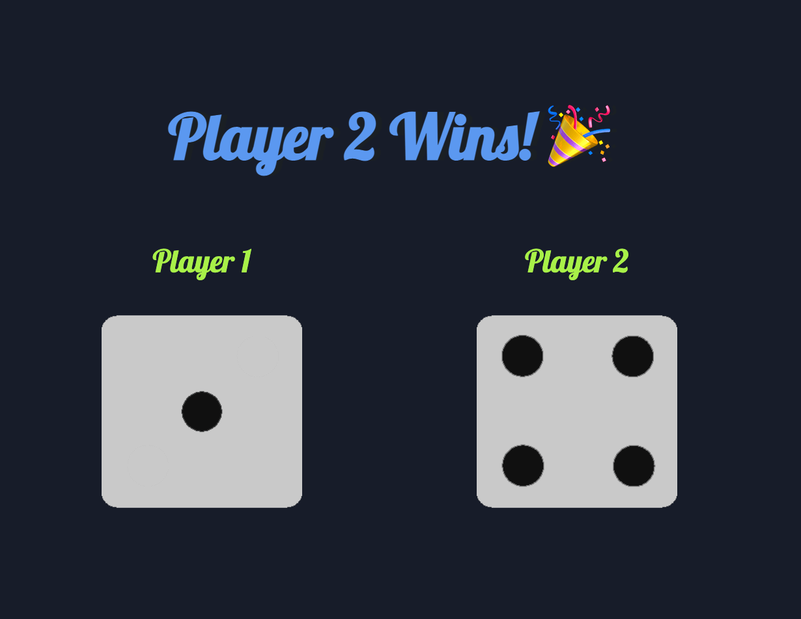

# Roll Two Dice Game

A vanilla JavaScript game that rolls two dice and displays the result.

> _Note: I built this mini app after following Angela Yu web dev course on Udemy back in 2019_

## Live Demo

[Play Now](https://emanuelefavero.github.io/roll-two-dice/)

#### Screenshot

## How to use

- Clone the repo
- Open `index.html` in your browser

## License

- [MIT](LICENSE.md)
